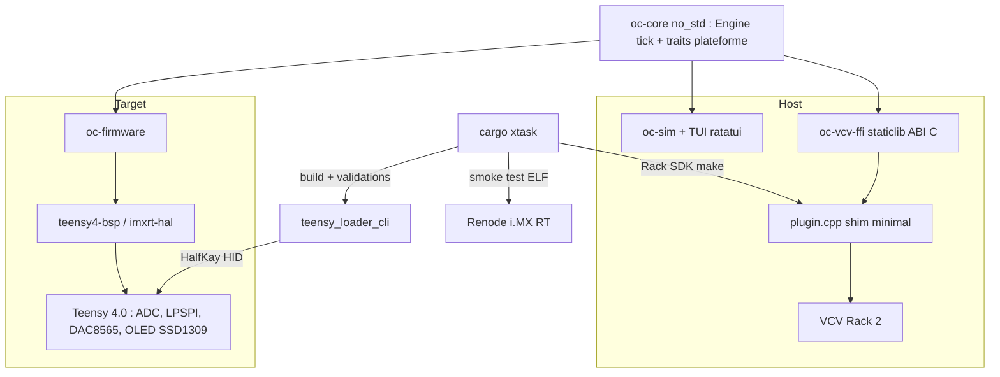

# Requirements

### Overview & Goals

Démarrage d'un firmware Rust pour le module Eurorack **Ornament & Crime** (variante TLM Audio, MCU **Teensy 4.0 / NXP i.MX RT1062**, Cortex-M7 @600 MHz). L'objectif de ce plan n'est **pas** la richesse musicale mais la mise en place d'une **fondation d'ingénierie complète et vérifiable** : cross-compilation, harnais de test local, intégration VCV Rack 2, et outil de flash sécurisé.

Le firmware applicatif du premier jalon est volontairement trivial : un **applet de diagnostic I/O** qui prouve que toute la chaîne matérielle fonctionne.

### Scope

**In scope**
- Workspace Cargo multi-crates, `no_std` pour le cœur et le firmware.
- Chaîne de cross-compilation `thumbv7em-none-eabihf` reproductible (`rust-toolchain.toml`, `.cargo/config.toml`, `memory.x`).
- Crate `oc-core` : logique métier `no_std`, sans aucune dépendance matérielle, pilotée par des traits de plateforme.
- Applet **Diagnostic I/O** : affichage des 4 CV in, 4 trigger in, encodeurs/boutons ; génération d'un offset/rampe sur les 4 CV out.
- Simulateur natif + **TUI ratatui** avec horloge virtuelle déterministe.
- **Plugin VCV Rack 2** : C++ réduit au strict minimum imposé par le Rack SDK, au-dessus d'une `staticlib` Rust ; build piloté par `cargo xtask`.
- **`cargo xtask flash`** : validations pré-flash puis délégation à `teensy_loader_cli`.
- Tests unitaires, tests d'intégration sur le simulateur, benchmarks **criterion** du DSP/quantification, CI GitHub Actions.
- Smoke test **Renode** : le vrai ELF ARM boote et journalise sur LPUART.

**Out of scope (pour ce plan)**
- Applets musicaux Phazerville (quantizers, séquenceurs, LFO…) — jalons ultérieurs.
- Sauvegarde EEPROM des presets, calibration persistante complète.
- Modèles Renode fidèles ADC/LPSPI/DAC8565/OLED.
- Support des variantes hardware autres que Teensy 4.0.

### User Stories

- En tant que développeur, je veux `cargo build --release -p oc-firmware` produire un binaire ARM valide sans configuration manuelle.
- En tant que développeur, je veux `cargo run -p oc-sim` ouvrir une TUI où je manipule CV et triggers et vois l'écran du module répliqué, sans matériel.
- En tant qu'utilisateur VCV Rack, je veux poser un module O&C (Rust) dans un patch et le câbler comme le module réel.
- En tant que développeur, je veux `cargo xtask flash` refuser tout binaire suspect avant d'écrire sur le module.
- En tant que mainteneur, je veux que la CI compile les trois cibles, exécute les tests et les benchmarks.

### Functional Requirements

**FR1 — Cross-compilation**
- Cible `thumbv7em-none-eabihf`, toolchain épinglée, `flip-link` pour la protection de pile.
- `memory.x` décrivant ITCM/DTCM/OCRAM/FLASH du Teensy 4.0, sections de boot i.MX RT (FCB, IVT).
- Sortie `.hex` générée automatiquement.

**FR2 — Applet Diagnostic I/O**
- Lecture des 4 entrées CV (12 bits, ADC1/ADC2) puis conversion en volts.
- Lecture des 4 entrées trigger avec anti-rebond et compteur d'événements.
- Lecture des 2 encodeurs (quadrature) et de leurs boutons + boutons haut/bas.
- Écriture des 4 sorties CV via DAC8565 (SPI) : mode offset réglable à l'encodeur, mode rampe.
- Rendu OLED 128x64 : tableau des valeurs, indicateur signal présent / entrée branchée, compteur de boucle et temps de cycle.

**FR3 — Simulateur TUI**
- Sliders CV in, touches pour les triggers, rotation d'encodeurs, framebuffer 128x64 rendu en braille.
- Horloge virtuelle : pas-à-pas, x1, accéléré ; enregistrement/rejeu d'un scénario d'entrées.

**FR4 — Module VCV Rack 2**
- 4 entrées CV, 4 entrées trigger, 4 sorties CV, 2 encodeurs, 4 boutons, écran rendu par nanovg depuis le framebuffer `oc-core`.
- Détection de câble via `isConnected()` transmise à `oc-core`.
- Le code C++ ne contient **aucune** logique métier : uniquement la déclaration du module, le mapping ports/params et l'appel de l'ABI C.

**FR5 — Flash sécurisé**
- Vérifications avant écriture : architecture ELF ARM, taille inférieure à 1984 Ko, présence du FlexSPI Configuration Block, vecteur de reset plausible, empreinte SHA-256 affichée, confirmation interactive (`--yes` pour la CI).
- Refus explicite et code de sortie non nul en cas d'échec ; aucun appel à `teensy_loader_cli` dans ce cas.

### Non-Functional Requirements
- Boucle principale à au moins 1 kHz, budget de cycle mesuré et affiché.
- `#![forbid(unsafe_code)]` dans `oc-core` ; tout `unsafe` du firmware isolé, documenté (`# Safety`) et concentré dans le HAL.
- `#![deny(warnings)]`, `clippy::pedantic`, `rustfmt` en CI.
- Le simulateur doit être bit-à-bit déterministe pour une séquence d'entrées donnée.

# Technical Design

### Current Implementation

Le dépôt `/Users/pascal/haveneer/Alambic` est **vide** (seulement `.git` et `.idea`). Tout est créé de zéro ; aucune convention préexistante à respecter hormis `RTK.md` (proxy CLI économe en tokens, sans impact sur le code).

Références externes retenues :
- `teensy4-bsp` / `imxrt-hal` / `imxrt-rt` — support Teensy 4.0 en Rust, matures.
- `embedded-hal` 1.0 — traits de périphériques.
- `embedded-graphics` + `ssd1306`/`ssd1309` — rendu OLED, avec `SimulatorDisplay` côté hôte.
- `teensy_loader_cli` + bootloader **HalfKay** (ROM, non effaçable, donc pas de brick définitif possible).
- Renode : plateforme i.MX RT1064 déjà fournie, modèle GPT i.MX RT disponible.

### Key Decisions

1. **Cœur partagé `no_std` piloté par traits** (validé). `oc-core` ne connaît ni registre ni OS ; firmware, simulateur et VCV fournissent chacun une implémentation des traits de plateforme. Une seule source de vérité comportementale.
2. **Jalon 1 = Diagnostic I/O** (validé). Prouve la chaîne complète sans dette de logique musicale.
3. **Simulation native + TUI comme harnais principal ; Renode limité au smoke test** (validé). On évite l'écriture de modèles C# ADC/LPSPI/DAC8565/OLED, dont le coût (1 à 2 semaines) est disproportionné face au gain à ce stade.
4. **`cargo xtask flash` en garde-fou, `teensy_loader_cli` en exécutant** (validé). On ne réécrit pas le protocole HID HalfKay éprouvé ; on ajoute les validations qui lui manquent.
5. **C++ VCV réduit à une coquille** (validé). Un unique `plugin.cpp` (~200 lignes) : déclaration du module, ports, widget, appels à l'ABI C. Build déclenché par `cargo xtask vcv build`, qui compile la `staticlib` puis invoque le `Makefile` du Rack SDK.
6. **Unité de signal interne : millivolts `i32`**, pas de flottants dans le chemin critique du firmware ; conversion en `f32` uniquement à la frontière VCV.
7. **Boucle principale coopérative sans RTOS** au départ : `loop` + timer, pas d'ordonnanceur. On évite la complexité concurrente tant qu'elle n'est pas justifiée ; `rtic` reste une option ultérieure documentée.

### Proposed Changes

**Contrats de plateforme (`oc-core/src/platform.rs`)**

```rust
/// Millivolts, signés. Échelle O&C : -5000..=+7500 mV environ.
pub type MilliVolts = i32;

pub trait AnalogIn {
    fn read_cv(&mut self, ch: CvChannel) -> MilliVolts;
    fn is_patched(&self, ch: CvChannel) -> bool;
}

pub trait AnalogOut {
    fn write_cv(&mut self, ch: CvChannel, value: MilliVolts);
    fn flush(&mut self);
}

pub trait DigitalIn {
    fn trigger_state(&self, ch: TriggerChannel) -> bool;
}

pub trait Controls {
    fn poll(&mut self) -> ControlEvents; // déplacements d'encodeurs + états boutons
}

pub trait Clock {
    fn now_micros(&self) -> u64;
}

/// Framebuffer monochrome 128x64, compatible embedded-graphics.
pub trait Display {
    fn frame_mut(&mut self) -> &mut FrameBuffer;
    fn present(&mut self);
}
```

**Moteur applicatif**

```rust
pub struct Engine<A: AnalogIn, O: AnalogOut, D: DigitalIn, C: Controls, K: Clock, S: Display> { /* ... */ }

impl<A, O, D, C, K, S> Engine<A, O, D, C, K, S> {
    /// Un tick complet : acquisition, traitement, sortie CV, rendu écran.
    pub fn tick(&mut self) -> TickReport; // durée, compteurs, état
}
```

`Engine::tick` est la **seule** fonction appelée par les trois backends : c'est le point de convergence testable.

**ABI C pour VCV (`oc-vcv-ffi/src/lib.rs`, `#[no_mangle] extern "C"`)**

```c
typedef struct OcEngine OcEngine;
OcEngine* oc_engine_new(void);
void      oc_engine_free(OcEngine*);
void      oc_engine_set_cv_in(OcEngine*, uint8_t ch, int32_t mv, bool patched);
void      oc_engine_set_trigger(OcEngine*, uint8_t ch, bool high);
void      oc_engine_encoder(OcEngine*, uint8_t idx, int8_t delta, bool pressed);
void      oc_engine_button(OcEngine*, uint8_t idx, bool pressed);
void      oc_engine_tick(OcEngine*, uint64_t now_micros);
int32_t   oc_engine_cv_out(const OcEngine*, uint8_t ch);
const uint8_t* oc_engine_framebuffer(const OcEngine*); // 1024 octets, 128x64 1bpp
```

Toutes les fonctions sont défensives (pointeur nul, index hors borne donnent un no-op) et enveloppent la logique dans `catch_unwind` pour ne jamais dérouler à travers la frontière FFI.

**Validations de `cargo xtask flash`**

 # | Vérification | Échec |
---|---|---|
 1 | ELF, `EM_ARM`, little-endian | abandon |
 2 | Taille `.text+.data` sous 1984 Ko | abandon |
 3 | FlexSPI Configuration Block présent à l'offset attendu | abandon |
 4 | Vecteur de reset dans une plage mémoire valide | abandon |
 5 | Cible `thumbv7em-none-eabihf` | abandon |
 6 | Périphérique Teensy détecté (VID `16C0`) | avertissement + attente bouton PROGRAM |
 7 | SHA-256 affichée + confirmation | `--yes` pour la CI |

### File Structure

```
Alambic/
- Cargo.toml                  # workspace
- rust-toolchain.toml
- .cargo/config.toml          # target par defaut, runner, alias xtask
- crates/
- oc-core/                 # no_std, forbid(unsafe_code) : traits + Engine + diagnostic
- oc-firmware/             # bin ARM : teensy4-bsp, ADC, LPSPI, DAC8565, SSD1309
- memory.x
- oc-sim/                  # backend hote + TUI ratatui + horloge virtuelle
- oc-vcv-ffi/              # staticlib, ABI C
- vcv/OrnamentCrimeRust/      # plugin.json, res/*.svg, src/plugin.cpp (minimal)
- xtask/                      # build, flash, vcv, renode, ci
- renode/oc-teensy40.repl|.resc
- .github/workflows/ci.yml
```

### Architecture Diagram



### Risks

 Risque | Impact | Mitigation |
---|---|---|
 Brochage exact du variant TLM Audio inconnu | Firmware inopérant sur le vrai module | Centraliser tout le pinout dans `oc-firmware/src/board.rs` ; le dériver des sources Phazerville et le valider avec l'applet diagnostic |
 Contrôleur OLED SSD1306 vs SSD1309 | Écran noir | Séquence d'init paramétrable, feature Cargo, test visuel via l'applet |
 Sections de boot i.MX RT (FCB/IVT) mal placées | Le module ne boote pas | S'appuyer sur `imxrt-rt`, qui gère ces sections ; valider par `cargo size` et le smoke test Renode |
 ABI FFI et panique traversant la frontière | Crash de VCV Rack | ABI C uniquement, `catch_unwind`, tests FFI dédiés côté Rust |
 Renode : modèles ADC/SPI absents | Smoke test bloqué au boot | Feature `sim-boot` sautant l'init des périphériques non modélisés ; le smoke test se limite au log LPUART |
 Divergence simulateur/hardware | Faux sentiment de sécurité | La conversion ADC/DAC et le rendu écran vivent dans `oc-core`, donc partagés ; seul l'accès registre diffère |

# Testing

### Validation Approach

Quatre niveaux, du moins coûteux au plus coûteux :

1. **Tests unitaires `oc-core`** — conversions mV / code ADC / code DAC, anti-rebond, décodage quadrature, détection signal présent, rendu framebuffer. Exécutés sur l'hôte, `oc-core` étant sans dépendance matérielle.
2. **Tests d'intégration sur le simulateur** — scénarios scriptables joués contre `Engine::tick` avec horloge virtuelle, assertions sur les sorties CV et le contenu du framebuffer.
3. **Smoke test Renode** — le vrai ELF ARM boote et émet la bannière de version sur LPUART, vérifié par un script Robot Framework.
4. **Validation matérielle manuelle** — checklist guidée par l'applet diagnostic sur le module réel.

### Key Scenarios

- Une entrée CV à 0 V, +5 V, -3 V donne les millivolts attendus, à la tolérance de calibration près.
- Un front sur trigger 1 incrémente son compteur exactement une fois, y compris avec des rebonds injectés.
- Rotation d'encodeur : offset CV out modifié du pas attendu, saturé aux bornes.
- Le framebuffer contient les libellés attendus après un tick (comparaison à un instantané de référence).
- L'ABI C survit à des pointeurs nuls, des index de canal invalides et un `tick` sans entrée configurée.
- `cargo xtask flash` sur un ELF x86, un binaire trop gros, un fichier tronqué : refus et code de sortie non nul, sans invocation de `teensy_loader_cli`.

### Edge Cases

- ADC saturé haut/bas : pas de débordement, saturation propre.
- Deux encodeurs tournés simultanément à grande vitesse (événements perdus tolérés, jamais de compte négatif erroné).
- Débranchement d'un câble en cours de fonctionnement : `is_patched` bascule sans glitch de sortie.
- Rollover du compteur de microsecondes.
- VCV Rack à des taux d'échantillonnage de 44,1 à 192 kHz : le tick moteur reste cadencé correctement par décimation.

### Test Changes

- `crates/oc-core/tests/` — tests d'intégration comportementaux.
- `crates/oc-core/benches/` — **criterion** : `engine_tick`, conversions CV, rendu du framebuffer ; garde-fou de régression de performance en CI.
- `crates/oc-sim/tests/scenarios/` — scénarios d'entrées rejouables.
- `crates/oc-vcv-ffi/tests/` — robustesse de l'ABI.
- `xtask/tests/` — validations pré-flash sur des binaires factices.
- `proptest` sur les conversions d'unités (aller-retour mV vers code puis mV).
- Pas de test unitaire dans `oc-firmware` : sa couverture vient de `oc-core` et du smoke test Renode.

# Estimations

### Coût / complexité / valeur

 Lot | Coût | Complexité | Valeur | Commentaire |
---|---|---|---|---|
 Workspace + toolchain + CI | ~0,5 j | Faible | **Critique** | Débloque tout le reste |
 `oc-core` (traits + Engine + diagnostic) | ~1,5 j | Moyenne | **Critique** | Cœur partagé, entièrement testable sur l'hôte |
 Simulateur + TUI | ~2 j | Moyenne | **Très élevée** | Harnais de développement quotidien |
 Firmware Teensy (ADC/SPI/DAC/OLED) | ~3 j | **Élevée** | Élevée | Risque principal : pinout et init OLED |
 `cargo xtask flash` | ~1 j | Faible | Élevée | Protection indépendante du bootloader ROM |
 Plugin VCV Rack 2 | ~2 j | Moyenne | Élevée | Le Rack SDK impose du C++ ; shim minimal |
 Benchmarks criterion | ~0,5 j | Faible | Moyenne | Garde-fou de régression |
 Smoke test Renode | ~1 j | Moyenne | Moyenne | Boîte noire, à limiter au boot |

**Total estimé : environ 11,5 jours-homme.**

### Note de sécurité matérielle

Le Teensy 4.0 embarque le bootloader **HalfKay** dans une puce dédiée non effaçable par le firmware applicatif : un mauvais firmware ne peut ni griller le module ni empêcher un flash ultérieur (le bouton PROGRAM restaure toujours le mode bootloader). Les risques matériels résiduels réels sont électriques : configuration d'une broche en sortie alors qu'elle est câblée en entrée, ou tension hors plage. Ils sont traités par une **table de pinout unique et centralisée** dans `oc-firmware/src/board.rs`, revue avant le premier flash, et non par l'outil d'upload.

# Delivery Steps

### ✓ Step 1: Mettre en place le workspace, la chaîne de cross-compilation et la CI
Un `cargo build --release -p oc-firmware` produit un binaire ARM valide, et la CI compile et teste le dépôt.

- Créer le workspace Cargo avec les membres `crates/oc-core`, `crates/oc-firmware`, `crates/oc-sim`, `crates/oc-vcv-ffi`, `xtask`.
- Épingler la toolchain dans `rust-toolchain.toml` (canal stable, composants `rust-src` et `llvm-tools`, cible `thumbv7em-none-eabihf`).
- Configurer `.cargo/config.toml` : cible par défaut du firmware, `flip-link` comme linker, alias `xtask`.
- Écrire `crates/oc-firmware/memory.x` (FLASH, ITCM, DTCM, OCRAM du Teensy 4.0) et dépendre de `imxrt-rt` / `teensy4-bsp` pour les sections de boot i.MX RT.
- Créer le squelette `xtask` (clap) avec les sous-commandes `build`, `size`, `hex`.
- Ajouter `.github/workflows/ci.yml` : `fmt`, `clippy -D warnings`, `test`, build ARM.
- Configurer les lints de workspace : `#![forbid(unsafe_code)]` pour `oc-core`, `clippy::pedantic`.
- Commit Git de la fondation.

### ✓ Step 2: Implémenter oc-core : traits de plateforme, moteur et applet diagnostic
`Engine::tick` produit des sorties CV et un framebuffer corrects à partir d'entrées simulées, validé par des tests hôte.

- Définir dans `platform.rs` les traits `AnalogIn`, `AnalogOut`, `DigitalIn`, `Controls`, `Clock`, `Display` et le type `MilliVolts`.
- Implémenter les conversions d'unités : code ADC 12 bits vers mV, mV vers code DAC8565 16 bits, avec offset et gain de calibration.
- Implémenter l'anti-rebond des triggers, le décodage de quadrature des encodeurs, la détection de signal présent.
- Implémenter `Engine::tick` : acquisition, mise à jour d'état, écriture CV out, rendu du framebuffer, retour d'un `TickReport`.
- Créer l'applet `DiagnosticApp` : tableau des 4 CV in, 4 triggers et contrôles, modes de sortie offset et rampe.
- Rendre l'écran avec `embedded-graphics` sur un framebuffer 128x64 1bpp.
- Ajouter les tests unitaires et les tests `proptest` d'aller-retour de conversion.
- Ajouter les benchmarks criterion `engine_tick` et `framebuffer_render`.
- Commit Git.

### ✓ Step 3: Construire le simulateur natif et la TUI ratatui
`cargo run -p oc-sim` ouvre une TUI pilotable qui exécute le vrai `oc-core` sans matériel.

- Implémenter dans `oc-sim` les backends des traits de plateforme, adossés à un état mutable en mémoire.
- Implémenter une horloge virtuelle déterministe avec modes pas-à-pas, temps réel et accéléré.
- Construire la TUI ratatui : sliders des 4 CV in, touches de déclenchement des 4 triggers, rotation et appui des encodeurs et boutons.
- Rendre le framebuffer 128x64 en caractères braille dans un panneau dédié, plus un panneau des 4 CV out et du temps de cycle.
- Ajouter l'enregistrement et le rejeu de scénarios d'entrées au format texte.
- Écrire les tests d'intégration `crates/oc-sim/tests/scenarios/` avec assertions sur les CV out et des instantanés de framebuffer.
- Commit Git.

### ✓ Step 4: Implémenter le firmware Teensy 4.0 et l'outil de flash sécurisé
Le module réel affiche l'écran de diagnostic et réagit aux CV, triggers et encodeurs, flashé par `cargo xtask flash`.

- Centraliser tout le brochage O&C dans `crates/oc-firmware/src/board.rs` : table unique, documentée, revue avant le premier flash.
- Implémenter les backends matériels : lecture ADC1/ADC2 des 4 CV, GPIO des 4 triggers, encodeurs en quadrature, boutons.
- Implémenter le pilote DAC8565 sur LPSPI et le pilote OLED SSD1309/SSD1306 avec séquence d'init sélectionnable par feature.
- Écrire la boucle principale coopérative cadencée à 1 kHz appelant `Engine::tick`, plus une bannière de version sur LPUART.
- Isoler et documenter chaque bloc `unsafe` avec une section `# Safety`.
- Implémenter `xtask flash` : validations ELF ARM, taille, présence du FCB, vecteur de reset, cible, détection USB `16C0`, empreinte SHA-256 et confirmation, puis délégation à `teensy_loader_cli`.
- Ajouter `xtask/tests/` couvrant les refus sur binaires invalides.
- ~~Ajouter la plateforme Renode `renode/oc-teensy40.repl` et `.resc` et le smoke test boot + log LPUART, branché en CI.~~ **NON FAIT / RESTE À FAIRE.** Le firmware ne pilote aucun UART : tous les LPUART disponibles sur les broches 0 à 23 entrent en conflit avec la façade (LPUART2 sur 14/15 = encodeur droit, LPUART6 sur 0/1 = TR1/TR2, LPUART4 sur 7/8 = OLED). Le smoke test « boot + log LPUART » doit donc être reformulé : soit bannière sur USB CDC (à implémenter d'abord), soit vérification via semihosting, soit observation de l'écriture SPI. À traiter dans un jalon ultérieur.
- Commit Git.

### ✓ Step 5: Livrer le module VCV Rack 2 au-dessus de la staticlib Rust
Un module O&C (Rust) apparait dans VCV Rack 2, câblable et affichant le même écran que le firmware.

- Implémenter `crates/oc-vcv-ffi` en `staticlib` exposant l'ABI C (`oc_engine_new`, `free`, `set_cv_in`, `set_trigger`, `encoder`, `button`, `tick`, `cv_out`, `framebuffer`), plus des accesseurs de comptage de canaux (`oc_engine_cv_channels`, etc.) pour que le C++ n'ait jamais à coder en dur le nombre de canaux.
- Rendre chaque fonction défensive (pointeurs nuls, index hors borne) et empêcher tout déroulement de panique à travers la frontière (`catch_unwind` + `AssertUnwindSafe`, justifié en commentaire).
- Générer l'en-tête C avec `cbindgen` depuis le build (`build.rs`, `cbindgen.toml`) ; l'ABI n'expose que des types C primitifs dans ses signatures pour que cbindgen n'ait jamais besoin de traverser vers `oc-core`.
- Écrire `vcv/OrnamentCrimeRust/src/plugin.cpp` et `Diagnostic.cpp` réduits au strict minimum : déclaration du module, 4 entrées CV, 4 entrées trigger, 4 sorties CV, 2 encodeurs, 4 boutons, widget d'écran nanovg (rectangles NanoVG par pixel allumé) lisant le framebuffer, sans aucune logique métier.
- Transmettre `isConnected()` de chaque port à `oc_engine_set_cv_in`, et décimer l'appel à `oc_engine_tick` à ~1 kHz via un accumulateur de microsecondes, quel que soit le taux d'échantillonnage.
- Ajouter `plugin.json` et le panneau SVG dans `res/`.
- Ajouter `xtask vcv build` (staticlib + en-tête + `make` du Rack SDK) et `xtask vcv install` (idem puis cible `install` du SDK, qui dépose déjà le `.vcvplugin` dans le bon dossier utilisateur par OS).
- Ajouter les tests de robustesse de l'ABI dans `crates/oc-vcv-ffi/tests/abi.rs` (pointeurs nuls partout, index hors borne, deux moteurs indépendants, tick sans configuration préalable) et documenter la procédure utilisateur dans le README.
- **Vérifié en conditions réelles** (au-delà des tests unitaires) : le plugin C++ a été compilé et lié avec succès contre un vrai Rack SDK 2.6.x téléchargé pour l'occasion — tous les symboles `oc_engine_*` sont résolus dans `plugin.dylib`, et `cargo xtask vcv build`/`install` reproduisent ce résultat de bout en bout, `make install` déposant un `.vcvplugin` valide dans un dossier utilisateur Rack de test.
- **RESTE À FAIRE** : le plugin n'a jamais été chargé dans une session VCV Rack réellement lancée — la disposition du panneau et l'émulation d'encodeur par rotation de potentiomètre (mouvement du bouton, pas position absolue) sont donc une première version à affiner à l'usage, pas un résultat validé à l'œil.
- Commit Git.