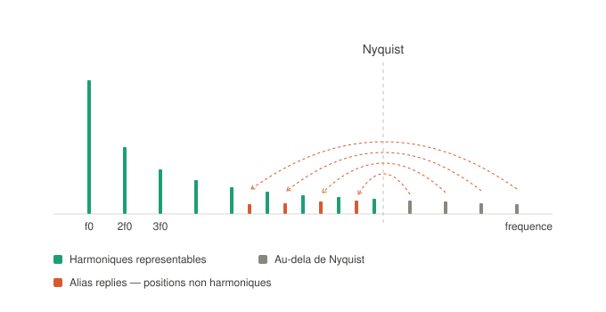
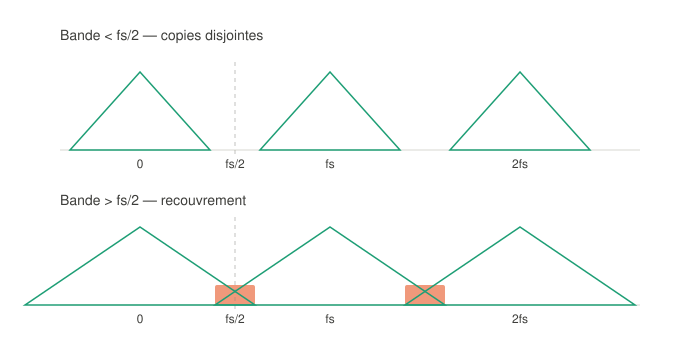
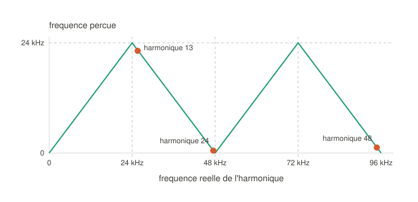
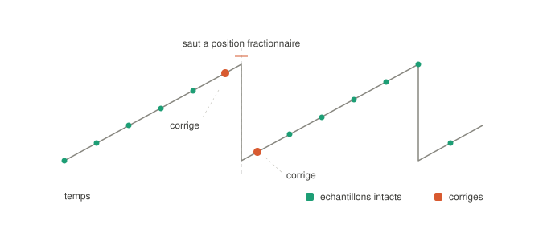

# Écrire un supersaw sur un Ornament & Crime / Teensy 4.0

*Notes de travail — de la faisabilité au diagnostic temps réel*

---

## 1. Le point de départ

La question initiale : le rack ne produit pas de supersaw jouable. Odessa est additif et n'atteint pas un spectre de dent de scie (au mieux un triangle, faute d'une loi d'amplitude en 1/n sur des partiels pairs et impairs). Le Batumi II produit bien quatre dents de scie anti-aliasées avec suivi V/Oct, mais sans aucun paramètre qui **lie** les quatre voix : il manque une hauteur commune et un désaccord proportionnel unique. Le Zadar peut générer une rampe (forme A0), mais son paramètre TIME est une **période**, inversement proportionnelle à la fréquence, alors que le V/Oct est exponentiel — la conversion n'existe pas proprement dans le rack, et la précision au voisinage de quelques millisecondes ne permet pas un désaccord de quelques cents.

D'où l'idée : l'écrire soi-même sur l'O&C, qui embarque déjà un Cortex-M7 et quatre sorties DAC.

---

## 2. Rappel — ce qu'est réellement un supersaw

Sept dents de scie désaccordées, sommées. C'est la signature du Roland JP-8000. Trois détails font la différence entre « sept scies empilées » et le vrai son :

- Le **désaccord est réparti de façon non linéaire** : trois voix vers le haut, trois vers le bas, une fixe sur la fondamentale, selon une courbe spécifique.
- Deux **lois de mixage opposées** : l'amplitude de la scie centrale décroît quand le désaccord augmente, celle des six latérales croît.
- Un **passe-haut accordé sur la fondamentale** appliqué à la somme. C'est le détail le plus souvent omis, et celui qui empêche le son de devenir boueux.

La rétro-ingénierie publiée par Adam Szabo est la référence pour les coefficients.

Point de vocabulaire important : le nombre canonique de voix est **7 par note**. Un module annoncé « 28 ondes » comme le Ripsaw fait 7 ondes sur 4 voix polyphoniques indépendantes. L'épaisseur d'une note reste 7. Au-delà de 7 ou 8, le désaccord sature perceptuellement.

---

## 3. L'algorithme, dans sa forme minimale

Un supersaw n'est rien d'autre que N accumulateurs de phase et une sommation :

```rust
// état : N phases dans [0,1)
for i in 0..N {
    let f_i = f0 * 2f32.powf(cents[i] / 1200.0);
    let inc = f_i / fs;
    phase[i] += inc;
    if phase[i] >= 1.0 { phase[i] -= 1.0; }
    out += gain[i] * (2.0 * phase[i] - 1.0);
}
```

Coût : environ 7 × 48 000 × 20 cycles ≈ 7 millions de cycles par seconde sur un cœur qui en fournit 600 millions, soit un peu plus de 1 % de charge. La RAM utilisée est de 7 flottants. Le CPU n'est jamais la contrainte.

Faire le calcul dans un seul moteur, plutôt que d'empiler des instances d'oscillateurs séparés, apporte trois avantages : le V/Oct est lu une fois et partagé, les rapports de désaccord sont exacts en flottant, et les courbes de mixage et le passe-haut final peuvent s'appliquer à la somme.

**Mais cet extrait naïf est inutilisable tel quel.** Il produit du repliement.

---

## 4. Les harmoniques

Une dent de scie idéale n'est pas une forme, c'est une somme infinie de sinusoïdes :

$$x(t) = \frac{2}{\pi}\sum_{n=1}^{\infty} \frac{(-1)^{n+1}}{n}\sin(2\pi n f_0 t)$$

- La composante `n` est à la fréquence **n·f₀**.
- Son amplitude est **1/n**, soit 20·log₁₀(1/n) en décibels — une pente de −6 dB par octave.

La somme ne s'arrête jamais : une discontinuité exige une largeur de bande infinie. C'est précisément l'angle vif de la rampe qui produit tout le contenu haute fréquence.

---

## 5. Alias et échantillonnage

Échantillonner à `fs`, c'est ne conserver que les valeurs aux instants `t = k/fs`. Or :

$$\sin\!\left(2\pi (f - f_s)\frac{k}{f_s}\right) = \sin\!\left(2\pi f \frac{k}{f_s} - 2\pi k\right) = \sin\!\left(2\pi f \frac{k}{f_s}\right)$$

Les deux suites d'échantillons sont **rigoureusement identiques**. La fréquence `f` n'a plus d'identité propre : elle partage sa suite de valeurs avec toute la famille `f + m·fs`. Elle a des pseudonymes — d'où le mot *alias*.

Il faut y ajouter les fréquences négatives : `sin(−θ) = −sin(θ)`, donc une composante à `−g` est indiscernable d'une composante à `+g` en opposition de phase. C'est ce qui produit un **repliement** plutôt qu'un simple décalage.



**Conséquence fondamentale : c'est irréversible.** Ce n'est pas une dégradation qu'un filtre pourrait atténuer. Au moment où l'échantillon est écrit dans le buffer, le contenu à 26 kHz *est devenu* un contenu à 22 kHz. Il n'y a plus rien à séparer. C'est une projection à sens unique, contrairement à une saturation ou à un filtrage mal réglé, qui sont des transformations.

---

## 6. Nyquist

Deux notions à ne pas confondre :

- La **fréquence de Nyquist** = fs/2, propriété du système d'échantillonnage. À 48 kHz : 24 kHz.
- Le **taux de Nyquist** = 2B, exigence imposée par la largeur de bande B du signal.

### Le théorème

Établi par Harry Nyquist en 1928, formalisé par Claude Shannon en 1949 :

> Si un signal `x(t)` ne contient aucune composante à une fréquence supérieure ou égale à B, alors il est **entièrement déterminé** par ses échantillons pris à une cadence `fs > 2B`.

La reconstruction est exacte, par interpolation sinc :

$$x(t) = \sum_{k=-\infty}^{\infty} x\!\left(\frac{k}{f_s}\right)\operatorname{sinc}\!\left(f_s t - k\right)$$

### Pourquoi exactement la moitié

Échantillonner revient à multiplier par un peigne de Dirac de pas `1/fs`, ce qui devient dans le domaine fréquentiel une **convolution** par un peigne de pas `fs` : le spectre est recopié autour de 0, ±fs, ±2fs, à l'infini. Un signal réel occupe `[−B, +B]`, donc chaque copie a une largeur `2B`. Les copies se chevauchent si et seulement si `2B > fs`.



Dans le cas du haut, un passe-bas idéal isole la copie centrale et récupère le signal exactement. Dans le cas du bas, les zones marquées appartiennent simultanément à deux copies : à une même fréquence coexistent deux contenus additionnés, et aucun filtre ne peut les séparer.

### Pourquoi l'inégalité est stricte

À `fs = 2B` précisément, une sinusoïde à `fs/2` échantillonnée à ses passages par zéro donne une suite entièrement nulle — quelle que soit son amplitude. La reconstruction est indéterminée. D'où `fs > 2B`, jamais l'égalité.

### En pratique

Les 44,1 kHz du CD viennent de là : l'audition s'arrête vers 20 kHz, il faudrait donc au minimum 40 kHz, et les 4 kHz restants forment une **bande de garde** dans laquelle le filtre anti-repliement analogique peut descendre progressivement. Un filtre à pente infinie n'existe pas.

**Asymétrie essentielle pour un synthétiseur** : à l'enregistrement, un filtre analogique protège le convertisseur en amont, et ça marche. En synthèse, il n'y a rien en amont — l'oscillateur écrit directement des nombres. Le repliement a déjà eu lieu quand la valeur arrive dans le buffer. L'anti-aliasing doit donc être **algorithmique**.

---

## 7. Où atterrissent les alias

En combinant périodisation et symétrie, on ramène `f` dans `[−fs/2, fs/2]` puis on prend la valeur absolue :

$$f_{\text{alias}} = \left|\, f - f_s \cdot \operatorname{round}\!\left(\frac{f}{f_s}\right) \right|$$

La fréquence perçue est donc une fonction **triangulaire** de la fréquence réelle, qui rebondit sur 0 et sur `fs/2`.



### Exemple chiffré : dent de scie naïve à 1975 Hz, fs = 48 kHz

Les harmoniques 1 à 12 sont représentables (le 12ᵉ est à 23 700 Hz, juste sous Nyquist). À partir du 13ᵉ :

| Harmonique | Fréquence réelle | Calcul | Où il atterrit | Niveau |
|---|---|---|---|---|
| 13 | 25 675 Hz | 25 675 − 48 000 | 22 325 Hz | −22 dB |
| 24 | 47 400 Hz | 47 400 − 48 000 | **600 Hz** | −28 dB |
| 25 | 49 375 Hz | 49 375 − 48 000 | **1 375 Hz** | −28 dB |
| 48 | 94 800 Hz | 94 800 − 2×48 000 | **1 200 Hz** | −34 dB |

Lecture de la colonne « calcul » : on divise la fréquence réelle par `fs`, on arrondit à l'entier le plus proche, on retranche ce multiple, on prend la valeur absolue. Pour l'harmonique 48, le rapport vaut 1,975, arrondi à **2**, d'où la soustraction de 96 000.

Noter que les harmoniques 24 et 25 sont voisins dans la série mais atterrissent de part et d'autre de zéro : c'est le rebond du triangle.

---

## 8. Pourquoi c'est audible et non filtrable

**Ce n'est pas filtrable.** Un alias à 600 Hz est au milieu de la musique. Aucun passe-bas ne l'atteint sans détruire ce qu'on veut garder.

**Le mouvement est inversé.** Sur une branche descendante du triangle, l'alias de l'harmonique `n` vaut `fs − n·f₀`, donc :

$$\frac{\partial}{\partial f_0}\left(f_s - n f_0\right) = -n$$

Monter la fondamentale de 10 Hz fait descendre l'alias de l'harmonique 24 de 240 Hz : **vingt-quatre fois plus vite que la note, en sens inverse**. Dans tout instrument acoustique, les partiels montent avec la fondamentale. Un partiel qui descend n'existe nulle part dans la nature — le cerveau cesse de les regrouper en un timbre unique et les entend comme des sons parasites.

**C'est dépendant de la note.** Propre en bas du clavier, sale en haut. Impossible à compenser au réglage.

**Ce n'est pas tempéré.** Les alias tombent à des hertz arbitraires, sans rapport avec la gamme. Dissonants par construction, et d'une dissonance qui change à chaque note.

**Ça se propage.** Tout traitement non linéaire en aval — saturation, wavefolder, compresseur — traite les alias comme du signal et en engendre de nouveaux. Une réverbe les étale dans le temps.

### Quatre facteurs aggravants, tous réunis ici

- **Notes aiguës** — voir le tableau.
- **Fréquence d'échantillonnage basse** — si l'ISR tourne à 16 kHz, Nyquist tombe à 8 kHz. Une note à 440 Hz n'a plus que 18 harmoniques représentables, une note à 2 kHz n'en a que quatre.
- **Sept voix désaccordées** — chaque voix engendre son propre jeu d'alias, à des positions légèrement différentes. Ils battent entre eux et produisent un bruit rugueux qui ne ressemble ni à de la saturation ni à du bruit blanc.
- **Traitement en aval** — un supersaw finit toujours dans un filtre résonant, souvent avec de la saturation.

À noter : le repliement est parfois **recherché** — chiptune, lo-fi, industriel. L'oscillateur wavetable de l'Oneiroi est décrit explicitement comme aliasé par son constructeur. La question n'est donc pas « propre ou sale », mais « choisi ou subi ».

---

## 9. PolyBLEP

### L'idée

Tout le contenu haute fréquence d'une dent de scie vient d'un seul endroit : la discontinuité au moment où la phase se réinitialise. Le reste est une rampe parfaitement lisse.

Un échelon idéal a un spectre infini. Sa version **limitée en bande** — celle qu'un système à `fs` peut représenter — est l'intégrale d'un sinus cardinal : une transition qui ondule légèrement avant et après le saut. Le **BLEP residual** est la différence entre les deux ; il est nul loin de la transition.

La méthode consiste donc à générer la rampe naïve, puis à **ajouter ce résidu** autour de chaque discontinuité. Le résultat est mathématiquement équivalent à une dent de scie limitée en bande.

Un BLEP exact demande une table de sinc fenêtré sur plusieurs dizaines d'échantillons. **PolyBLEP** approxime ce résidu par un polynôme du second degré sur ±1 échantillon.

### Le point clé : la discontinuité ne tombe pas sur un échantillon



C'est `dt`, l'incrément de phase par échantillon (`dt = f / fs`), qui donne la position fractionnaire du saut dans la grille — et donc la correction à appliquer aux deux échantillons qui l'encadrent.

### L'implémentation

```rust
#[inline(always)]
fn poly_blep(mut t: f32, dt: f32) -> f32 {
    if t < dt {
        // échantillon juste après la discontinuité
        t /= dt;
        t + t - t * t - 1.0
    } else if t > 1.0 - dt {
        // échantillon juste avant
        t = (t - 1.0) / dt;
        t * t + t + t + 1.0
    } else {
        0.0
    }
}

#[inline(always)]
fn saw(phase: f32, dt: f32) -> f32 {
    (2.0 * phase - 1.0) - poly_blep(phase, dt)
}
```

Environ cinq opérations par oscillateur, sans branchement dans le cas courant, sans table, sans mémoire.

### Ce que ça vaut

Atténuation des alias de l'ordre de 30 à 40 dB dans la bande audible. Ce n'est pas transparent — dans le haut du clavier, il en reste. Pour un supersaw, où sept voix se masquent mutuellement et où le passe-haut final coupe déjà du contenu, c'est largement suffisant.

### Les alternatives

| Méthode | Qualité | Coût | Remarque |
|---|---|---|---|
| PolyBLEP seul | bonne | ~5 ops/osc | meilleur rapport résultat/coût |
| Suréchantillonnage ×4 + PolyBLEP | excellente | ~4× CPU | recommandé ici, la marge existe |
| DPW | correcte | très faible | perd en précision dans le grave |
| Tables limitées en bande par octave | maximale | coût mémoire | l'approche Braids ; la RAM manque sur T4.0 |

---

## 10. Ce que le calcul ne résout pas : les images de reconstruction

Tout ce qui précède concerne le repliement **à l'intérieur** du calcul. Il reste un problème distinct : les **images** de reconstruction à `fs ± f`, que seul un filtre analogique en sortie peut supprimer. Un anti-aliasing interne parfait n'en protège pas.

C'est là que le matériel O&C montre sa limite : ses sorties sont dimensionnées pour du **CV**, pas pour de l'audio. Le filtrage anti-images y est typiquement très doux, voire absent. Sans réjection au-delà de Nyquist, les images reviennent dans l'audible sous forme de brillance sale et métallique, indépendamment de la qualité de l'algorithme.

**À vérifier sur le schéma de la carte** : y a-t-il un passe-bas d'ordre 2 ou plus après le DAC ? Si oui, c'est jouable. Sinon, il faudra filtrer en externe — un Belgrad ou un C4RBN en passe-bas fixe vers 15 kHz fait l'affaire.

L'auteur de Squares-and-Circles mentionne d'ailleurs une modification optionnelle de la plage de tension du DAC (±5 V), et écrit que le matériel O&C actuel présente « des limitations non contournables pour les applications audio ». Le constat est donc partagé.

---

## 11. Le point de comparaison : Squares-and-Circles

Le firmware alternatif d'eh2k pour O&C, ciblant le Teensy 4.0, démontre que le portage est faisable. Il propose quatre instances de moteurs configurables simultanément — batteries, oscillateurs, filtres, réverbes Dattorro et Clouds, delays, FM à deux opérateurs, Open303 — avec routage interne d'un moteur vers un autre et sortie mono ou stéréo.

Ce qu'on en déduit sur la cadence :

- Le **SPI n'est pas la contrainte** : le DAC8565 accepte jusqu'à 50 MHz d'horloge, une écriture fait 24 bits, soit 96 bits pour les quatre canaux — environ 3 µs à 30 MHz, contre une période de 20,8 µs à 48 kHz.
- Le **code réutilisé impose sa cadence** : beaucoup de code Mutable Instruments, dont Plaits, qui tourne nativement à 48 kHz.
- Le **chemin CV est explicitement séparé** : la documentation annonce les paramètres modulés par CV échantillonnés à **2 kHz**, cohérent avec l'ADC interne 12 bits du Teensy.
- Les **algorithmes disponibles l'exigent** : aucune réverbe ni delay n'a de sens sous 32 kHz.

Estimation : **48 kHz pour l'audio, 2 kHz pour le CV**.

Un point d'organisation à connaître si on envisage d'écrire un moteur pour ce firmware plutôt que le sien : le **loader** (routage virtuel, modulations, gestion des patchs) est closed-source ; seuls les moteurs sont publiés, comme binaires indépendants du matériel. Cette contrainte d'ABI ne s'applique **pas** à un firmware bare metal écrit de zéro.

---

## 12. Architecture recommandée pour un firmware bare metal

### Cadence

**48 kHz en sortie**, et le CPU excédentaire dépensé en **suréchantillonnage interne ×4** : calcul à 192 kHz, filtrage, décimation vers 48 kHz. On obtient un anti-aliasing bien meilleur que PolyBLEP seul, sans jamais solliciter le DAC ni l'étage analogique au-delà de leur zone de confort.

C'est le bon usage de la marge : la dépenser en qualité de calcul, pas en cadence de sortie. Monter à 96 kHz doublerait la charge pour repousser Nyquist dans une zone que le chemin analogique ne restitue pas.

Pour la boucle CV : décimer par 24 depuis l'ISR audio retombe sur 2 kHz, ce qui évite un second timer.

### Les plafonds réels, dans l'ordre

1. **Pas le CPU** — 12 500 cycles par échantillon à 48 kHz ; sept scies avec PolyBLEP en consomment quelques centaines.
2. **Pas le SPI** — ~3 µs par trame, et en DMA le coût CPU est quasi nul.
3. **Le temps d'établissement du DAC8565** — quelques microsecondes pour un échelon pleine échelle, ce qui plafonne autour de la centaine de kHz avec une précision qui se dégrade bien avant.
4. **L'étage de sortie analogique** — facteur limitant absolu, dimensionné pour du CV.

### Le DAC en DMA : le changement structurant

Si l'ISR **écrit** directement dans le DAC, tout blocage devient audible. Avec un **DMA déclenché par timer sur double buffer**, l'ISR ne fait plus que remplir un tampon : elle peut être retardée de plusieurs microsecondes, voire d'une demi-période, sans qu'un seul échantillon soit affecté.

On passe d'une contrainte de latence dure à une contrainte de débit moyen. C'est ce qui rend le système robuste.

### Priorités d'interruption

ISR audio à la priorité NVIC la plus haute. Écran, encodeurs, USB nettement plus bas.

### Deux pièges Rust sur cette cible

- Le Cortex-M7 a un **D-cache**. Le buffer DMA doit être aligné et placé dans une région non mise en cache, ou faire l'objet des opérations de maintenance appropriées. C'est une source classique d'échantillons corrompus — qui ressemblent, eux aussi, à des clics.
- Aucune allocation ni verrou dans l'ISR.

---

## 13. Le partage de bus avec l'OLED

Symptôme observé sur des essais naïfs de sinusoïdes : ça « tique ».

### Trois causes possibles, indiscernables à l'oreille

| Cause | Mécanisme | Effet sur l'échantillon |
|---|---|---|
| Contention de bus | l'écran occupe le SPI, l'écriture DAC attend | retardé |
| Famine d'interruption | rafraîchissement à priorité égale ou supérieure, ou section critique | perdu |
| Dépassement de budget | l'ISR ne tient pas dans sa période | indépendant de l'écran |

### Le protocole de diagnostic

**Étape 0, trente secondes** : désactiver complètement le rafraîchissement de l'écran et écouter. Si le tic persiste, l'écran n'est pas en cause.

**Étape 1** : basculer un GPIO au début et à la fin de l'ISR, et un second GPIO pendant le rafraîchissement écran. Sur un oscilloscope deux voies — le Mordax DATA suffit — la lecture est immédiate :

- l'impulsion ISR **disparaît** pendant la trame écran → famine ;
- elle est seulement **décalée** → contention ;
- elle **s'élargit** → budget CPU.

Le même montage donne aussi la charge CPU en pourcentage de la période, par simple lecture du rapport cyclique, sans instrumentation logicielle.

### Les remèdes, par ordre de robustesse

1. **Priorité NVIC + DAC en DMA.** Rend le problème sans objet si le transfert DAC ne partage pas le périphérique SPI de l'écran : le DMA sert le DAC pendant que l'OLED bloque le CPU.
2. **Découper la trame écran.** Si le bus est réellement partagé, ne jamais envoyer le framebuffer d'un bloc : le fragmenter en quelques lignes par période audio, en cédant le bus entre chacune. L'écran se rafraîchit dix fois plus lentement, l'utilisateur ne le voit pas, et aucun blocage ne dépasse une période.
3. **Rafraîchir dans les silences**, quand la sortie est nulle ou statique.

**Ce qui ne suffit pas** : baisser le taux de rafraîchissement. Cela réduit la fréquence des perturbations, pas leur amplitude — on passe d'un clic à 30 Hz à un clic toutes les deux secondes. Un artefact isolé et périodique est parfois plus audible qu'un bruit régulier, parce que l'oreille l'isole.

**Ce qui est acceptable en dépannage mais pas en architecture** : couper l'écran pendant le jeu. On perd la lisibilité au moment où elle est la plus utile.

### Piste matérielle

L'O.R.N.8 (O&C sur Teensy 4.1) gère huit entrées CV, huit sorties, MIDI, USB host, SD et de l'audio stéréo — il a nécessairement séparé ses bus. Son schéma vaut le coup d'œil même sans intention d'achat : c'est un travail de conception déjà fait sur exactement cette contrainte. Regarder en particulier si l'OLED y est passé en I²C plutôt qu'en SPI, ce qui est le choix évident pour libérer le SPI au profit du DAC.

Note au passage : le Teensy 4.1 utilise **le même IMXRT1062** que le 4.0, donc les mêmes ADC. Ses apports réels sont 8 Mo de flash au lieu de 2, un socket microSD en SDIO natif, un PHY Ethernet, un port USB host, plus de broches, et deux emplacements SOIC-8 pour ajouter de la PSRAM. C'est cette PSRAM qui change ce qu'on peut écrire : avec 1 Mo interne, pas de réverbe ni de granulaire ; avec 8 ou 16 Mo, si.

---

## 14. Prochaines étapes

- [ ] Test GPIO à deux voies pour identifier laquelle des trois causes produit le tic
- [ ] Lire le schéma de la carte : filtre de reconstruction après le DAC, et bus de l'OLED
- [ ] Passer le DAC en DMA double buffer, priorité NVIC audio au maximum
- [ ] Implémenter PolyBLEP sur une voix, valider à l'oreille et au spectre
- [ ] Étendre à 7 voix avec la courbe de désaccord JP-8000 et les deux lois de mixage
- [ ] Ajouter le passe-haut accordé sur la fondamentale
- [ ] Ajouter le suréchantillonnage ×4 seulement si le repliement reste audible

---

## Annexe — formulaire

| Grandeur | Expression |
|---|---|
| Série de Fourier, dent de scie | $\frac{2}{\pi}\sum_{n\geq1} \frac{(-1)^{n+1}}{n}\sin(2\pi n f_0 t)$ |
| Amplitude de l'harmonique n | $1/n$, soit $20\log_{10}(1/n)$ dB |
| Fréquence de Nyquist | $f_s/2$ |
| Condition de Shannon | $f_s > 2B$ |
| Fréquence repliée | $\left\lvert f - f_s\cdot\operatorname{round}(f/f_s)\right\rvert$ |
| Dérive de l'alias | $\partial(f_s - n f_0)/\partial f_0 = -n$ |
| Incrément de phase | $dt = f / f_s$ |
| Reconstruction idéale | $\sum_k x(k/f_s)\operatorname{sinc}(f_s t - k)$ |
